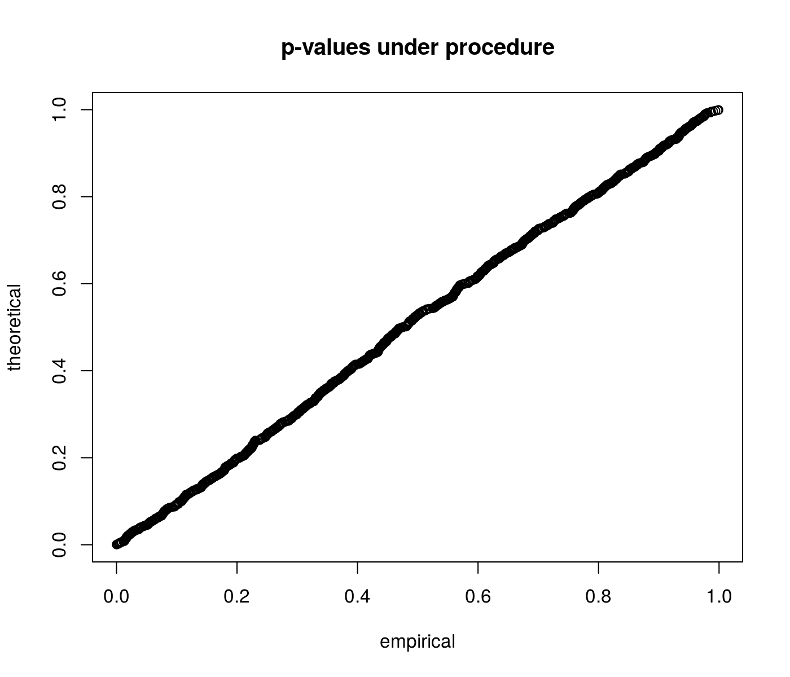

# epsiwal

[](https://travis-ci.org/shabbychef/epsiwal)
[](http://codecov.io/github/shabbychef/epsiwal?branch=master)
[](https://cran.r-project.org/package=epsiwal)
[](http://www.r-pkg.org/pkg/epsiwal)
[](http://www.r-pkg.org/pkg/epsiwal)

Implements conditional inference on normal variates as described in 
Lee, Sun, Sun and Taylor, "Exact Post Selection Inference, with Application to the Lasso."

-- Steven E. Pav, shabbychef@gmail.com

## Installation

This package may be installed from CRAN; the latest version may be
found on [github](https://www.github.com/shabbychef/epsiwal "epsiwal")
via devtools, or installed via [drat](https://github.com/eddelbuettel/drat "drat"):


```r
# CRAN
install.packages(c("epsiwal"))
# devtools
if (require(devtools)) {
    # latest greatest
    install_github("shabbychef/epsiwal")
}
# via drat:
if (require(drat)) {
    drat:::add("shabbychef")
    install.packages("epsiwal")
}
```

# Basic Usage

First we perform some simulations under the null to show that the p-values
are uniform. We draw a normal vector with identity covariance and zero mean,
then flip the sign of each element to make them positive. We then
perform inference on the sum of the mean values. 


```r
library(epsiwal)
p <- 20
mu <- rep(0, p)
Sigma <- diag(p)
A <- -diag(p)
b <- rep(0, p)
eta <- rep(1, p)
Sigma_eta <- diag(Sigma)
eta_mu <- as.numeric(t(eta) %*% mu)
set.seed(1234)
pvals <- replicate(1000, {
    y <- rnorm(p, mean = mu, sd = sqrt(diag(Sigma)))
    ay <- abs(y)
    pconnorm(y = ay, A = A, b = b, eta = eta, Sigma_eta = Sigma_eta, 
        eta_mu = eta_mu)
})
qqplot(pvals, qunif(ppoints(length(pvals))), main = "p-values under procedure", 
    ylab = "theoretical", xlab = "empirical")
```




```r
library(epsiwal)
p <- 20
mu <- rep(0, p)
Sigma <- diag(p)
A <- -diag(p)
b <- rep(0, p)
eta <- rep(1, p)
Sigma_eta <- diag(Sigma)
eta_mu <- as.numeric(t(eta) %*% mu)
type_I <- 0.05
set.seed(1234)
civals <- replicate(5000, {
    y <- rnorm(p, mean = mu, sd = sqrt(diag(Sigma)))
    ay <- abs(y)
    ci <- ci_connorm(y = ay, A = A, b = b, p = type_I, 
        eta = eta, Sigma_eta = Sigma_eta)
})
cat("Empirical coverage of the", type_I, "confidence bound is around", 
    mean(civals < eta_mu), ".\n")
```

```
## Empirical coverage of the 0.05 confidence bound is around 0.052 .
```

## See also

* The original paper, by Lee, J. D., Sun, D. L., Sun, Y. and Taylor, J. E. 
	[Exact post-selection inference, with application to the Lasso](https://arxiv.org/abs/1311.6238).
* The [`PSAT` package](https://github.com/ammeir2/PSAT), which supports similar
	procedures, but is not yet on CRAN.
* The [`SelectiveInference` package](https://cran.r-project.org/package=selectiveInference),
	which implements similar inferential procedures under quadratic
	constraints, as detailed in Tibshirani, R. J., Taylor, J., Lockhart, R. and Tibshirani, R. 
	[Exact Post-Selection Inference for Sequential Regression Procedures](https://arxiv.org/abs/1401.3889).

