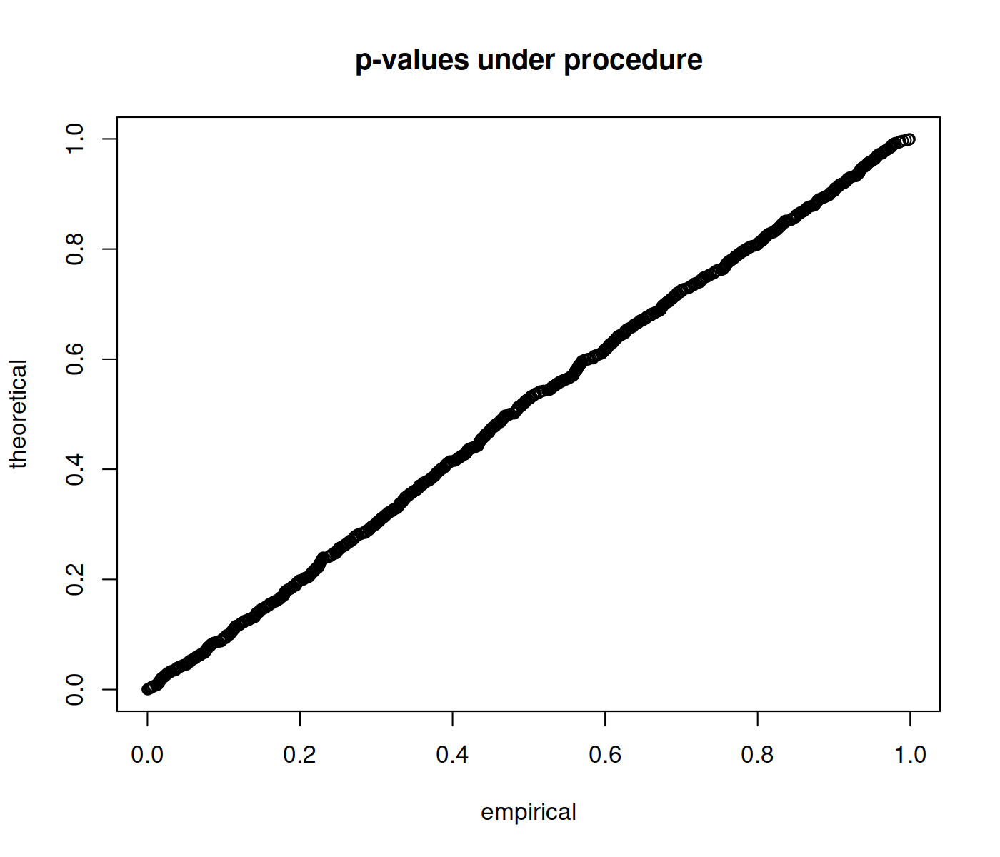

# epsiwal

[](https://github.com/shabbychef/epsiwal/actions)
[](https://app.codecov.io/github/shabbychef/epsiwal)
[](https://cran.r-project.org/package=epsiwal)
[](https://r-pkg.org/pkg/epsiwal)
[](https://r-pkg.org/pkg/epsiwal)

Implements conditional inference on normal variates as described in 
Lee, Sun, Sun and Taylor, "Exact Post Selection Inference, with Application to the Lasso."

-- Steven E. Pav, shabbychef@gmail.com

## Installation

This package may be installed from CRAN; the latest version may be
found on [github](https://github.com/shabbychef/epsiwal "epsiwal")
via devtools, or installed via [drat](https://github.com/eddelbuettel/drat "drat"):


``` r
# CRAN
install.packages(c("epsiwal"))
# devtools
if (require(devtools)) {
    # latest greatest
    install_github("shabbychef/epsiwal")
}
# via drat:
if (require(drat)) {
    drat:::add("shabbychef")
    install.packages("epsiwal")
}
```

# Basic Usage

First we perform some simulations under the null to show that the p-values
are uniform. We draw a normal vector with identity covariance and zero mean,
then flip the sign of each element to make them positive. We then
perform inference on the sum of the mean values. 


``` r
library(epsiwal)
p <- 20
mu <- rep(0, p)
Sigma <- diag(p)
A <- -diag(p)
b <- rep(0, p)
eta <- rep(1, p)
Sigma_eta <- diag(Sigma)
eta_mu <- as.numeric(t(eta) %*% mu)
set.seed(1234)
pvals <- replicate(1000, {
    y <- rnorm(p, mean = mu, sd = sqrt(diag(Sigma)))
    ay <- abs(y)
    pconnorm(y = ay, A = A, b = b, eta = eta, Sigma_eta = Sigma_eta,
        eta_mu = eta_mu)
})
qqplot(pvals, qunif(ppoints(length(pvals))), main = "p-values under procedure",
    ylab = "theoretical", xlab = "empirical")
```

<div class="figure">

<p class="caption">plot of chunk under_null_pvals</p>
</div>


``` r
library(epsiwal)
p <- 20
mu <- rep(0, p)
Sigma <- diag(p)
A <- -diag(p)
b <- rep(0, p)
eta <- rep(1, p)
Sigma_eta <- diag(Sigma)
eta_mu <- as.numeric(t(eta) %*% mu)
type_I <- 0.05
set.seed(1234)
civals <- replicate(5000, {
    y <- rnorm(p, mean = mu, sd = sqrt(diag(Sigma)))
    ay <- abs(y)
    ci <- ci_connorm(y = ay, A = A, b = b, p = type_I,
        eta = eta, Sigma_eta = Sigma_eta)
})
cat("Empirical coverage of the", type_I, "confidence bound is around",
    mean(civals < eta_mu), ".\n")
```

```
## Empirical coverage of the 0.05 confidence bound is around 0.052 .
```

# Maximum Likelihood Estimation

The package supports the "Selective MLE" procedure of Reid, Taylor and
Tibshirani.  This is via the `mle_connorm` function, or the associated `mle_connorm_max`.


``` r
library(epsiwal)
p <- 20
mu <- rep(0, p)
Sigma <- diag(p)
A <- -diag(p)
b <- rep(0, p)
eta <- rep(1, p)
Sigma_eta <- diag(Sigma)
set.seed(1234)
y <- rnorm(p, mean = mu, sd = sqrt(diag(Sigma)))
ay <- abs(y)
mval <- mle_connorm(y = ay, A = A, b = b, eta = eta,
    Sigma_eta = Sigma_eta)
cat("MLE is ", mval, " while true value is 0.\n")
```

```
## MLE is  2.1  while true value is 0.
```


# Inference on the Maximum

A common problem is to perform inference on the maximum of a normal vector.
This package provides convenience functions for this case when the vector
is assumed to have a common variance and common correlation (equicorrelation).

Suppose we observe $y_i \sim N(\mu_i, \sigma^2)$ with $\mathrm{corr}(y_i, y_j) = \rho$.
We find the maximum element $y_k$ and want to perform inference on its mean $\mu_k$,
conditional on it being the maximum.


``` r
library(epsiwal)
set.seed(123)
n <- 8
sigma <- 1.2
rho <- 0.3
mu <- rnorm(n, mean = 2)

# Generate data
Sigma <- sigma^2 * ((1 - rho) * diag(n) + rho * matrix(1,
    n, n))
y <- MASS::mvrnorm(1, mu, Sigma)

# Find the maximum
k <- which.max(y)
yk <- y[k]
yk1 <- y[-k]

# what is the true value?
cat("True mu_k is:", mu[k], "\n")
```

```
## True mu_k is: 3.7
```

``` r
# Inference on mu_k 1. P-value for a specific
# mu_k
p_val <- pconnorm_max(yk, yk1, mu_k = mu[k], sigma = sigma,
    rho = rho)
cat("P-value for true mu_k:", p_val, "\n")
```

```
## P-value for true mu_k: 0.94
```

``` r
# 2. Confidence interval for mu_k
ci <- ci_connorm_max(yk, yk1, sigma = sigma, rho = rho)
cat("95% CI for mu_k:", ci, "\n")
```

```
## 95% CI for mu_k: 8.3 3
```

``` r
# 3. Maximum Likelihood Estimate for mu_k
mle <- mle_connorm_max(yk, yk1, sigma = sigma, rho = rho)
cat("MLE for mu_k:", mle, "\n")
```

```
## MLE for mu_k: 5.8
```

## See also

* The original paper, by Lee, J. D., Sun, D. L., Sun, Y. and Taylor, J. E. 
	[Exact post-selection inference, with application to the Lasso](https://arxiv.org/abs/1311.6238).
* A companion paper which considered the "Selective MLE", Reid, S., Taylor, J. and Tibshirani, R. 
	[Post-selection point and interval estimation of signal sizes in Gaussian samples](https://arxiv.org/abs/1405.3340).
* The [`PSAT` package](https://github.com/ammeir2/PSAT), which supports similar
	procedures, but is not yet on CRAN.
* The [`SelectiveInference` package](https://cran.r-project.org/package=selectiveInference),
	which implements similar inferential procedures under quadratic
	constraints, as detailed in Tibshirani, R. J., Taylor, J., Lockhart, R. and Tibshirani, R. 
	[Exact Post-Selection Inference for Sequential Regression Procedures](https://arxiv.org/abs/1401.3889).
* Two papers I wrote which needed all this functionality:
	* Pav, S. E. [Conditional inference on the asset with maximum Sharpe ratio](https://arxiv.org/abs/1906.00573).
	* Pav, S. E. [Post selection estimation of Sharpe ratios](https://arxiv.org/abs/2606.01650).

